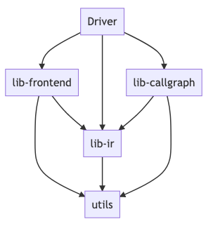
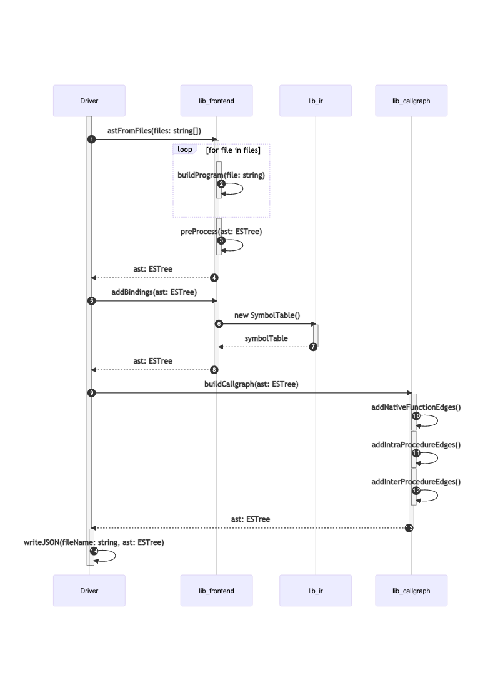

# Developer Documentation

This documentation is intended for developers to navigate through callgraph-generator's code base.

Callgraph-generator converts an ESTree compliant abstract syntax tree (AST) into a callgraph. Callgraph-generator is not responsible for parsing (lexing) Javscript source code into an ESTree.

Callgraph-generator is organised into separate components that depend on each other. The component structure follows a frontend (parser) - IR (intermediate representation) - backend (code generation) structure that many common compilers adopt.

## Components

Callgraph-Generator is made of the following components:

- Main Driver (`driver`)
- Frontend Parser (`lib-frontend`)
- IR (Intermediate Representation) (`lib-ir`)
- Callgraph generator (`lib-callgraph`)
- Misc Utilities (`utils`)

### Dependency Structure

### Sequence Diagram

The following sequence diagram provides a high level, partial overview of the most important calls in callgraph-generator. Some lesser important calls have been deliberately left out to keep the sequence diagram readable. Lifelines in this diagram represent directory level components rather than individual classes.

### [Driver](#)

### [Frontend](#)

### [IR](#)

### [Callgraph](#)

### [Utils](#)
